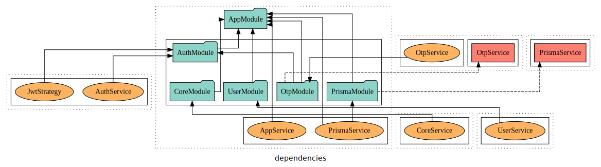
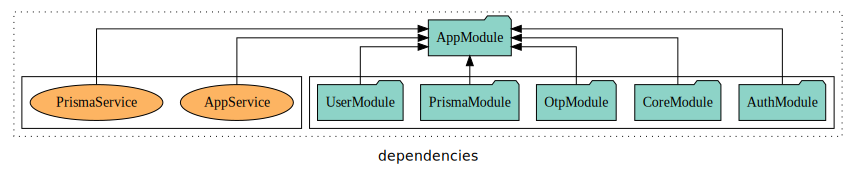

#### App where I developed Backend for Kawach Hackathon.

Stack used

- Prisma - for Postgres ORM
- reddis - Cache secondary storage
- Docker - to host and run postgres [locally only] `railway` for hosting cloud postgres
- NestJS(express-TS) - backend framework
- python - api testing
- Typescript
- PassportJs - Auth and jwt management
- Twillio - SMS messaging

### How did it Go

- I used Compose Docs for generating the documentation and i am serving it over `/docs` route of [server](https://kawach-hackathonbackend-production.up.railway.app/)
- Prisma well i used to maintain all my db works and i guess i am in love with it 🥰 , Prisma ORM is flexible for me to setup relations easily and manage creating via `npx prisma migrate dev` and moniter my database from `npx prisma studio`
- i am maintaining several tables and several many to many relations from dbs. Got few tables with infor prefetched from national cyber forensics cordination centre and other tables which has demand data about our current users prisma ORM manages them for me
- Postgres was awesome to work with rn as i was currently using Prisma it doesnt make sense for me as it is `Mysql` or `Postgres`
- Docker i am using to run my postgres instance on port `5434` on locally and on railway for cloud
- Running Redis instance on docker for OTP support

Pending tasks

- Lay pipelines for 6 types of fraud detection
- trigger ml models
- query tables and calculate stats of an entity

##Dependencies and Architecture

